# ECE DEVOPS Project User-API

It is a basic **NodeJS** web application exposing **REST API** that creates and stores user parameters in **Redis database**

## Prérequis

Cette application est écris en **NodeJS** et utilise **Redis** comme base de donnée

1. [Installer NodeJS](https://nodejs.org/en/download/)

2. [Install Redis](https://redis.io/download)


## Instructions

## 1. Create a web application

Pour le projet, on utilise l'API utilisateur présenté ici [Userapi in Corrections](https://github.com/adaltas/ece-devops-2022-fall-corrections/tree/main/userapi).

### Installation

Allez dans le répertoire racine de l'application (ici userapi/, où le fichier `package.json` est localisé) et lancer:

``` bash
npm install
```

### Utilisation

1. Démarrer le serveur web

Dans le répertoire racine de l'application, lancer:

``` bash
npm start
```

Cela démarre un serveur web disponible dans votre navigateur à l'adresse http://localhost:3000. Voici la page web obtenu :

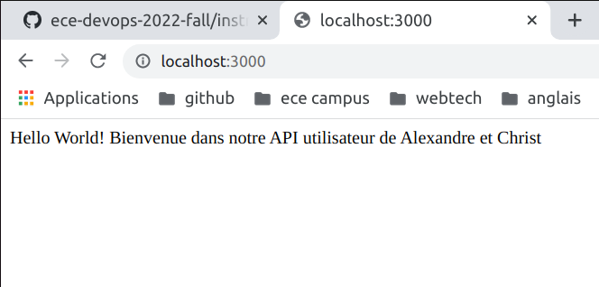

2. Créer un utilisateur

Envoyer une requête POST (REST protocol) en utilsant le terminal:

```bash
curl --header "Content-Type: application/json" \
  --request POST \
  --data '{"username":"alexcmr","firstname":"Alexandre","lastname":"Correia"}' \
  http://localhost:3000/user
```

Il affichera:

```
{"status":"success","msg":"OK"}
```

### Tester

Dans le répertoire racine de l'application, lancer:

```
npm test
```

Voici le résultat obtenu des 12 tests: 

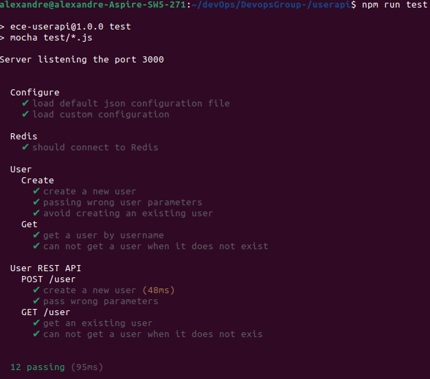


## 2. Apply CI/CD pipeline

1. Configurer et appliquer CI/CD pipeline

On va dans un premier temps créer un flux de travail (CI workflow) pour notre application à l'aide d'un fichier yaml dans `.github/workflows` que 'on configurera grace a GithubActions. Ce flux de travail devra permettre a notre application en Node JS de se connecter au serveur Redis pour pouvoir effectuer les tests avant cahque déploiment de notre application, dans le but de garantir son intégrité. Voici le fichier de flux de travail:

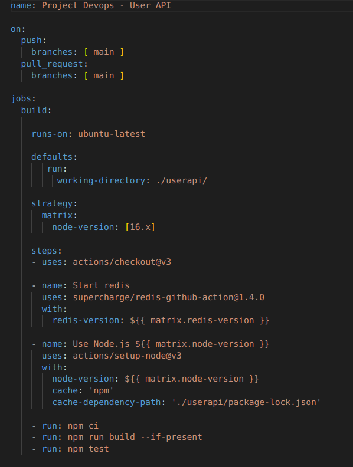

A chaque push de nouveau code dans notre repository, voici ce qui apparaît dans notre repository au niveau de Github Actions:

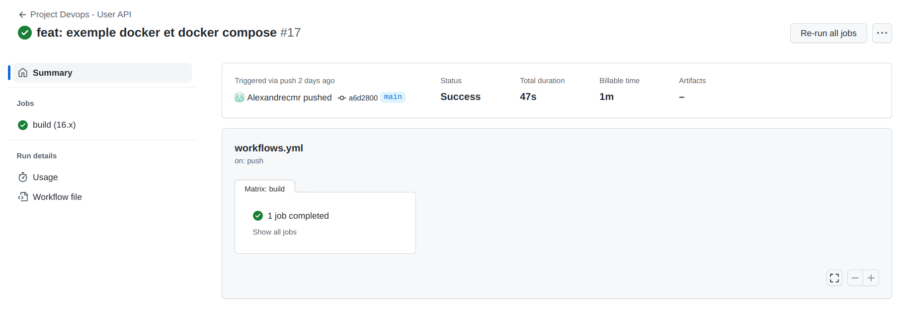

On voit bien que le statut du jobs est `Succed`, donc les tâches se sont exécutés correctement, notre application est bien opérationelle et prête a être déployé.

## 4. Build Docker image of your application

Docker permet d'automatiser le déploiement des applications au sein d'un environnement de conteneurs, environnement que nous définissons.

### Installation

1. Installez [Docker Desktop](https://www.docker.com/get-started) en suivant les instructions en fonction de votre système d'exploitation.

2. Assurez-vous que votre installation Docker fonctionne correctement en exécutant la commande suivante dans un terminal :

```
docker run hello-world
```

### Utilisation

1. Configurer l'image docker

Créer un [Dockerfile](https://github.com/RovaEncoder/DevopsGroup-/blob/main/userapi/Dockerfile) dans le répertoire racine du projet.

2. Construire l'image docker de notre application. Pour cela il faut lancer la commande suivante dnas le répertoire racine de notre projet 

```
docker build -t devops-user-api .
```

Voici ce qu'on obtient :

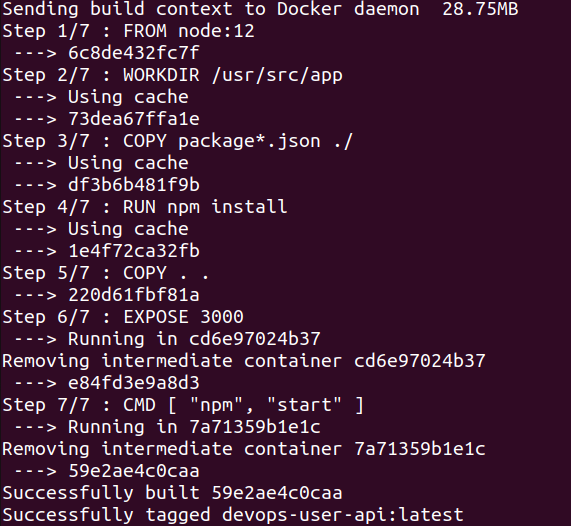

* Vous pouvez vérifier s'il l'image de votre application apparaît dans vos images Docker locales :

```
docker images 
```
3. Executer l'image de votre application dans un container Docker avec la commande suivante :

```
docker run -p 3001:3000 -d devops-user-api
```

* On peut vérifier que le container s'éxécute bien grace a la commande suivante :

```
docker ps
```

* Voici ce qu'on obtient dans le terminal :

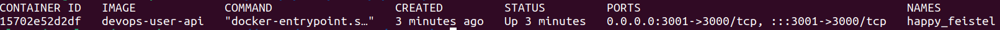

5. On push notre image Docker sur [DockerHub](https://hub.docker.com/) à l'aide de la commande suivante (sans oublier le [.dockerignore]():

```
docker push alexcmr27/userapi
```
* Voici ce que l'on obtient dans le terminal:

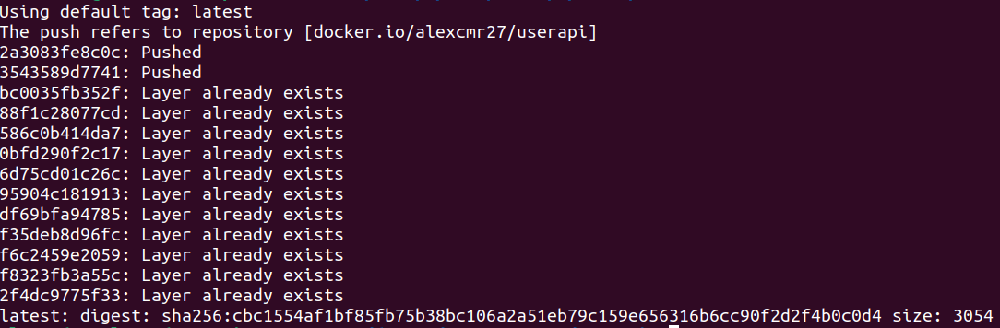

6. On stoppe le container avce la commande suivante: 

```
docker stop <CONTAINER_ID>
```

* Voici ce que l'on obtient dans le terminal:


### Test 

* Si vous vous rendez sur [https://localhost:3001](https://localhost:3001), vous pourrez obtenir la page d'accueil :

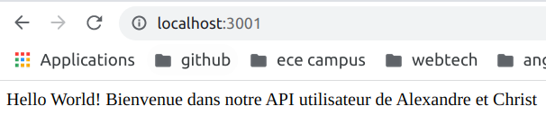

* Si vous rendez sur [notre compte](https://hub.docker.com/r/alexcmr27/userapi) DockerHub, vous pourrez accèder à l'image docker de notre apllication que vous pourrez alors pull:

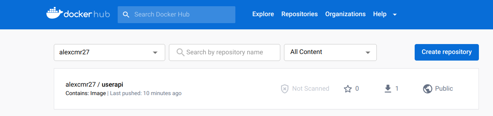

## 5. Make container orchestration using Docker Compose

L'image de notre apllication que l'on a obtenus a partir du Dockerfile execute un container de notre application mais sans la connexion à notre base de donnée Redis. C'est la que Dockercompose et le principe de multi-containers intervient.

### Installation

Procéder à l'installation de [Docker Desktop](https://www.docker.com/get-started/)

### Utilisation

1. A partir du fichier de configuration [docker-compose.yaml](https://github.com/RovaEncoder/DevopsGroup-/blob/main/userapi/docker-compose.yaml), executer la commande docker-compose suivante qui démarrera les service Redis à partir d'un container contenant une image de Redis et fera la connexion avec l'autre container qui contient l'image de notre application :

```bash
docker compose up
```

* Voici ce que l'on obtient dans le terminal:

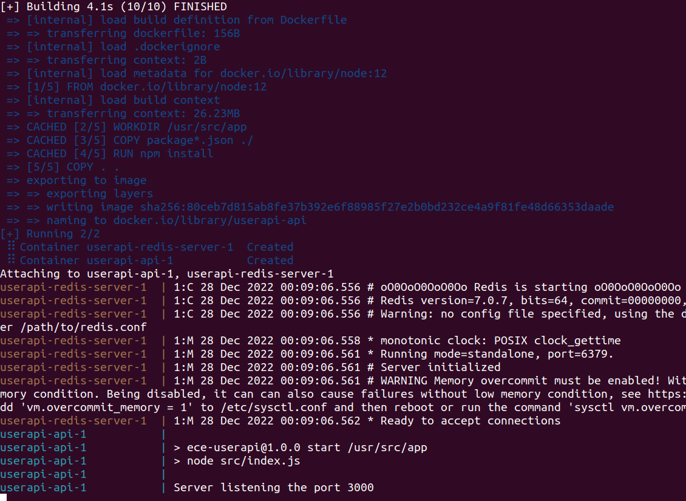

2. Pour stopper les containers (serveur Redis et notre application), il suffit d'éxécuter la commande suivante:

```bash
docker compose down
```

### Test

* Si vous vous rendez sur [https://localhost:3001](https://localhost:3001), vous pourrez obtenir la page d'accueil :


* Si vous voulez retrouver les informations d'un utilsateur à partir de cette requête exécuter dans le containr de notre application

```bash
curl --header "Content-Type: application/json" \
  --request POST \
  --data '{"username":"alexcmr","firstname":"Alexandre","lastname":"Correia"}' \
  http://localhost:3000/user
```

Il affichera:

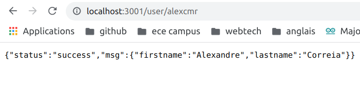

## 6. Make docker orchestration using Kubernetes

## Author

Alexandre CORREIA & Christ ABESSOLO
