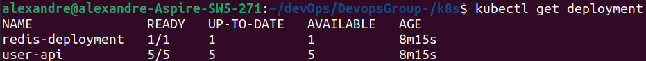
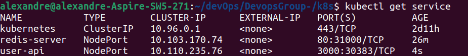
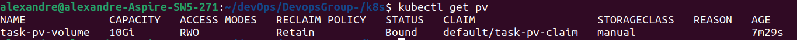
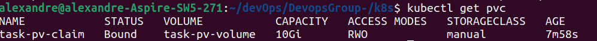
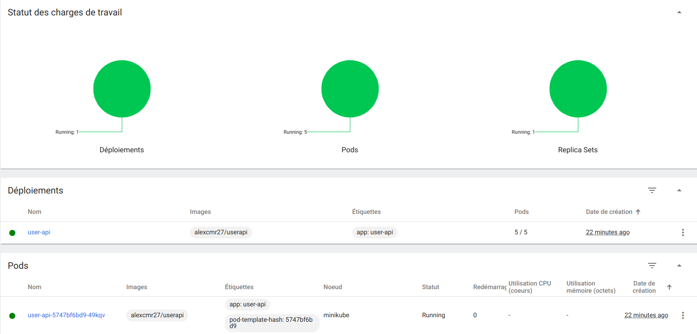

# ECE DEVOPS Project User-API

It is a basic **NodeJS** web application exposing **REST API** that creates and stores user parameters in **Redis database**

## Prérequis

Cette application est écris en **NodeJS** et utilise **Redis** comme base de donnée

1. [Installer NodeJS](https://nodejs.org/en/download/)

2. [Install Redis](https://redis.io/download)

## Instructions

## 1. Create a web application

Pour le projet, on utilise l'API utilisateur présenté ici [Userapi in Corrections](https://github.com/adaltas/ece-devops-2022-fall-corrections/tree/main/userapi).

### Installation

Allez dans le répertoire racine de l'application (ici userapi/, où le fichier `package.json` est localisé) et lancer:

```bash
npm install
```

### Utilisation

1. Démarrer le serveur web

Dans le répertoire racine de l'application, lancer:

```bash
npm start
```

Cela démarre un serveur web disponible dans votre navigateur à l'adresse http://localhost:3000. Voici la page web obtenu :


2. Créer un utilisateur

Envoyer une requête POST (REST protocol) en utilsant le terminal:

```bash
curl --header "Content-Type: application/json" \
  --request POST \
  --data '{"username":"alexcmr","firstname":"Alexandre","lastname":"Correia"}' \
  http://localhost:3000/user
```

Il affichera:

```
{"status":"success","msg":"OK"}
```

### Tester

Dans le répertoire racine de l'application, lancer:

```
npm test
```

Voici le résultat obtenu des 12 tests:


## 2. Apply CI/CD pipeline

1. Configurer et appliquer CI/CD pipeline

On va dans un premier temps créer un flux de travail (CI workflow) pour notre application à l'aide d'un fichier yaml dans `.github/workflows` que 'on configurera grace a GithubActions. Ce flux de travail devra permettre a notre application en Node JS de se connecter au serveur Redis pour pouvoir effectuer les tests avant cahque déploiment de notre application, dans le but de garantir son intégrité. Voici le fichier de flux de travail:


A chaque push de nouveau code dans notre repository, voici ce qui apparaît dans notre repository au niveau de Github Actions:


On voit bien que le statut du jobs est `Succed`, donc les tâches se sont exécutés correctement, notre application est bien opérationelle et prête a être déployé.

## 3. Configure and provision a virtual environment and run your application using the IaC approach

Nous avons utilisé Vagrant pour configurer et gérer notre machine virtuelle, puis Ansible pour provisionner la machine virtuelle

### Prérequis:

#### Installation:

1. [Installer VirtualBox](https://www.virtualbox.org/wiki/Downloads) (ou un autre hyperviseur)
2. [Installer Vagrant](https://www.vagrantup.com/downloads.html)

Ouvrir le terminal puis acceder au fichier IaC/ puis lancer la comande:

```bash
vagrant up
```

NB: Cette commande

1. Initialise et lance la machine virtuelle
2. Télécharge Ansible et le provisionnement mis en place par le playbook Anssible.

Nous utilisons le système d'exploitation hashicorp/bionic64 : une version de base de très optimisée d'ubuntu

Apres le téléchargement lancez la commande:

```bash
vagrant ssh nodejs_server
```

Ici, notre VM est liée au fichier userapi/ grâce à la propriété "synced_older" qui est dans le Vagrantfile

Une fois connecté, vous pouvez parcourir le répertoire avec les commandes ci-dessous:

```bash
$ cd ../..
$ cd /home/userapi
$ ls
```

Avec la dernière commande vous verrez les fichiers composants de notre dossier userapi.

## 4. Build Docker image of your application

Docker permet d'automatiser le déploiement des applications au sein d'un environnement de conteneurs, environnement que nous définissons.

### Installation

1. Installez [Docker Desktop](https://www.docker.com/get-started) en suivant les instructions en fonction de votre système d'exploitation.

2. Assurez-vous que votre installation Docker fonctionne correctement en exécutant la commande suivante dans un terminal :

```
docker run hello-world
```

### Utilisation

1. Configurer l'image docker

Créer un [Dockerfile](https://github.com/RovaEncoder/DevopsGroup-/blob/main/userapi/Dockerfile) dans le répertoire racine du projet.

2. Construire l'image docker de notre application. Pour cela il faut lancer la commande suivante dnas le répertoire racine de notre projet

```
docker build -t devops-user-api .
```

Voici ce qu'on obtient :


- Vous pouvez vérifier s'il l'image de votre application apparaît dans vos images Docker locales :

```
docker images
```

3. Executer l'image de votre application dans un container Docker avec la commande suivante :

```
docker run -p 3001:3000 -d devops-user-api
```

- On peut vérifier que le container s'éxécute bien grace a la commande suivante :

```
docker ps
```

- Voici ce qu'on obtient dans le terminal :


5. On push notre image Docker sur [DockerHub](https://hub.docker.com/) à l'aide de la commande suivante (sans oublier le [.dockerignore](https://github.com/RovaEncoder/DevopsGroup-/blob/main/userapi/.dockerignore):

```
docker push alexcmr27/userapi
```

- Voici ce que l'on obtient dans le terminal:


6. On stoppe le container avce la commande suivante:

```
docker stop <CONTAINER_ID>
```

- Voici ce que l'on obtient dans le terminal:


### Test

- Si vous vous rendez sur [https://localhost:3001](https://localhost:3001), vous pourrez obtenir la page d'accueil :


- Si vous rendez sur [notre compte](https://hub.docker.com/r/alexcmr27/userapi) DockerHub, vous pourrez accèder à l'image docker de notre apllication que vous pourrez alors pull:


## 5. Make container orchestration using Docker Compose

L'image de notre apllication que l'on a obtenus a partir du Dockerfile execute un container de notre application mais sans la connexion à notre base de donnée Redis. C'est la que Dockercompose et le principe de multi-containers intervient.

### Installation

Procéder à l'installation de [Docker Desktop](https://www.docker.com/get-started/)

### Utilisation

1. A partir du fichier de configuration [docker-compose.yaml](https://github.com/RovaEncoder/DevopsGroup-/blob/main/userapi/docker-compose.yaml), executer la commande docker-compose suivante qui démarrera les service Redis à partir d'un container contenant une image de Redis et fera la connexion avec l'autre container qui contient l'image de notre application :

```bash
docker compose up
```

- Voici ce que l'on obtient dans le terminal:


2. Pour stopper les containers (serveur Redis et notre application), il suffit d'éxécuter la commande suivante:

```bash
docker compose down
```

### Test

- Si vous vous rendez sur [https://localhost:3001](https://localhost:3001), vous pourrez obtenir la page d'accueil :


- Si vous voulez retrouver les informations d'un utilsateur à partir de cette requête exécuter dans le containr de notre application

```bash
curl --header "Content-Type: application/json" \
  --request POST \
  --data '{"username":"alexcmr","firstname":"Alexandre","lastname":"Correia"}' \
  http://localhost:3000/user
```

Il affichera:


## 6. Make docker orchestration using Kubernetes

Kubernetes est un système open source qui permet a ces utilisateurs d'automatiser le déploiement, la montée en charge et la mise en œuvre de conteneurs d'application sur des clusters de serveurs. La différence avec docker est que kubernetes propose plus de fonctionnalité que docker, comme l'auto-discovery

### Installation

Vous devez installer [Minikube](https://minikube.sigs.k8s.io/docs/start/): il s'agit d'un outil facilitant l'éxécution locale de Kubernetes.

- Voici la commande pour démarrer minikube:

```bash
minikube start
```

- Voici la commande pour vérifier que le cluster kubernetes en utilsant Minikube fonctionne bien :

```bash
minikube status
```

### Utilisation

Pour appliquer le deployment, les servives et les volumes Kubernetes; il faut se placer dans le répertoire [/k8s](https://github.com/RovaEncoder/DevopsGroup-/tree/main/k8s) et exécuter la commande suivante

```bash
kubectl apply -f <filename.yaml>
```

Voici les différents fichier qui faut exécuter:

- [deployment.yaml](https://github.com/RovaEncoder/DevopsGroup-/blob/main/k8s/deployment.yaml) qui décrit un état souhaité de notre API et notre base de donnée Redis.
- [service.yaml](https://github.com/RovaEncoder/DevopsGroup-/blob/main/k8s/service.yaml) qui permet d'exposer notre API et notre serveur Redis s'éxécutant sur un ensemble de pods en tant que service réseau.
- [persistentvolume.yaml](https://github.com/RovaEncoder/DevopsGroup-/blob/main/k8s/persistentvolume.yaml) est un élément de stockage dans le cluster qui a été provisionné par un administrateur.
- [persistentvolumeclaim.yaml](https://github.com/chemsss/devops-project/blob/main/k8s/persistentvolumeclaim.yaml) est une demande de stockage fait par l'utilisateur pour notre API.

Ensuite, il suffit de vérifier que toutes les entités sont bien en cours d'éxécution

- Pour les déployement:

```bash
kubectl get deployment
```

On obtient:



- Pour les services:

```bash
kubectl get service
```

On obtient:



- Pour le PersistentVolume:

```bash
kubectl get pv
```

On obtient:



- Pour le PersistentVolumeClaim:

```bash
kubectl get pvc
```

On obtient:



### Tester

- Dans un premier temps, on peut tester si tout fonctionne correctement grâce a cette commande :

```bash
minikube dashboard
```

On obtient :



- Ensuite, on vérifie que les pods s'éxécute bien gràce a la commande suivante:

```bash
kubectl get pods
```

On obtient:


- Pour finir, on exécute une commande qui nous permet de redirger le flux d'information de nos pods vers un port souhaité:

```bash
kubectl port-forward deployment/user-api 3000:3000
```

Voici ce que l'on obtient sur l'adresse [https://localhost:3000](https://localhost:3000):


## 7. Make a service mesh using Istio

Istio est une plateforme Open Source de Service Mesh qui permet de contrôler la manière dont les données sont partagées entre les microservices. Cela permettra de faire un maillage de service entre notre API et la base de donnée Redis.

### Installation

- Tout d'abord il faut vérifié que kubernetes s'éxécute correctement grâce aux comandes suivantes :

```bash
minikube start
minikube status
```

- Ensuite il faut installer [Istio](https://istio.io/docs/setup/getting-started/) jusqu'a cette [étape](https://istio.io/docs/setup/getting-started/#next-steps)

### Utilisation

Tout d'abord, il faut modifier le fichier [deployment.yaml](https://github.com/RovaEncoder/DevopsGroup-/blob/main/istio/deployment.yaml). Maintenant on crée 4 déploiment: deux déploiment concerne une premiere version de notre code (v1) et les deux autres uen deuxième version (v2); chaque version comporte un déploiment de notre API et une autre du serveur Redis. Voici la commande que l'on eéxécute dans le répertoire [/istio](https://github.com/RovaEncoder/DevopsGroup-/tree/main/istio):

```bash
kubectl apply -f deployment.yaml
```

Ensuite, on crée un fichier [routerequest.yaml](https://github.com/RovaEncoder/DevopsGroup-/blob/main/istio/routerequest.yaml) qui permet de créer une configuration pour router les requêtes entre 2 versions différentes de votre application.

### 8. Implement Monitoring to our containerized application

- Grafana est une plateforme gratuite et ouverte qui permet de concevoir et de partager des tableaux de bord et des graphiques. Elle peut être utilisée pour se connecter à différentes sources de données, y compris Prometheus, et offre une interface conviviale pour créer et visualiser des graphiques et des diagrammes.

- Prometheus est une collection d'outils open source destinés à surveiller et à alerter sur les systèmes. Son fonctionnement consiste à récupérer des mesures provenant de multiples sources et à les stocker dans une base de données de séries chronologiques.

Prometheus et Grafana sont deux outils qui, lorsqu'ils sont utilisés ensemble, fournissent une solution robuste pour surveiller et visualiser les performances du système et des applications. Ils sont généralement déployés avec des applications conteneurisées qui s'exécutent sur Kubernetes.

- Nous avons utilisé la prom-clientbibliothèque pour exposer plusieurs points de terminaison de métrique à partir de notre application API utilisateur.


- Ensuite, nous utilisons les deux services Prometheus et Grafana dans le localhost en utilisant ces commandes:

```
kubectl port-forward svc/prometheus -n istio-system 9090
kubectl port-forward svc/grafana -n istio-system 3000

```

## Author

Alexandre CORREIA & Christ ABESSOLO
